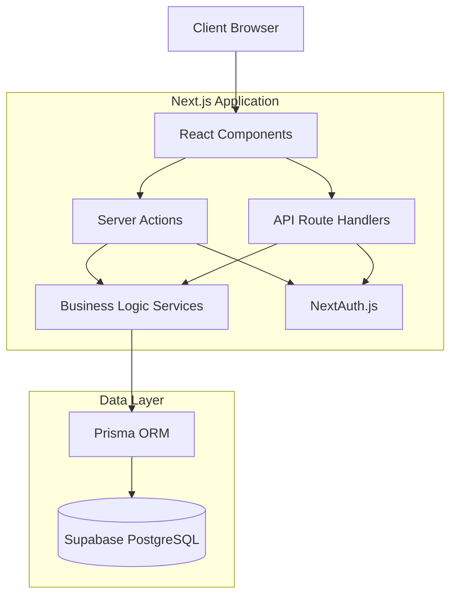

# Design Document

## Overview

The School Management System is a full-stack web application built with Next.js 16, React 19, TypeScript, and Tailwind CSS. The system implements a role-based architecture supporting three user types (Admin, Teacher, Student) with distinct capabilities. The application uses Next.js App Router for routing, React Server Components for optimal performance, and Server Actions for data mutations. Data persistence is handled through a relational database with Prisma ORM, and authentication is managed via NextAuth.js with JWT tokens.

The architecture follows a layered approach:

- **Presentation Layer**: React components with Tailwind CSS styling
- **API Layer**: Next.js Server Actions and Route Handlers
- **Business Logic Layer**: Service classes for domain operations
- **Data Access Layer**: Prisma ORM with Supabase PostgreSQL database

## Architecture

### System Architecture



### Technology Stack

- **Frontend**: React 19, TypeScript, Tailwind CSS
- **Backend**: Next.js 16 App Router, Server Actions
- **Database**: Supabase PostgreSQL with Prisma ORM
- **Authentication**: NextAuth.js v5 (Auth.js)
- **Internationalization**: next-intl for i18n support
- **Validation**: Zod for schema validation
- **Testing**: Vitest for unit tests, fast-check for property-based testing

### Database Schema

```mermaid
erDiagram
    User ||--o{ Class : teaches
    User ||--o{ Enrollment : enrolls
    User ||--o{ Notification : receives
    User ||--o{ Announcement : creates
    GradingPolicy ||--o{ Class : "defines grading for"
    Class ||--o{ Enrollment : has
    Class ||--o{ Assignment : has
    Class ||--o{ Exam : has
    Assignment ||--o{ Grade : has
    Assignment ||--o| Exam : "linked to"
    Enrollment ||--o{ Grade : receives
    Enrollment ||--o| FinalGrade : has
    Exam ||--o{ ExamSubmission : has
    ExamSubmission ||--o{ QuestionResponse : contains
    User ||--o{ ExamSubmission : submits

    User {
        string id PK
        string email UK
        string password
        string name
        enum role
        boolean active
        string locale
        datetime createdAt
        datetime updatedAt
    }

    Class {
        string id PK
        string code UK
        string name
        string subject
        string teacherId FK
        int capacity
        string gradingPolicyId FK
        datetime createdAt
        datetime updatedAt
    }

    GradingPolicy {
        string id PK
        string name
        enum type
        json scale
        datetime createdAt
        datetime updatedAt
    }

    Assignment {
        string id PK
        string title
        string classId FK
        enum type
        int maxPoints
        int weight
        datetime dueDate
        string examId FK
        datetime createdAt
        datetime updatedAt
    }

    Enrollment {
        string id PK
        string studentId FK
        string classId FK
        datetime enrolledAt
        enum status
    }

    Grade {
        string id PK
        string enrollmentId FK
        string assignmentId FK
        string classId FK
        int numericValue
        string letterValue
        string feedback
        datetime recordedAt
        datetime updatedAt
    }

    FinalGrade {
        string id PK
        string enrollmentId FK
        string classId FK
        int numericValue
        string letterValue
        float gpaValue
        datetime calculatedAt
        datetime updatedAt
    }

    Announcement {
        string id PK
        string title
        string content
        string authorId FK
        enum targetAudience
        string targetClassId FK
        datetime createdAt
        datetime updatedAt
    }

    Notification {
        string id PK
        string userId FK
        string announcementId FK
        boolean read
        datetime createdAt
    }

    Exam {
        string id PK
        string title
        string classId FK
        string assignmentId FK
        int totalPoints
        datetime dueDate
        boolean published
        datetime createdAt
        datetime updatedAt
    }

    Question {
        string id PK
        string examId FK
        string text
        int points
        int order
    }

    ExamSubmission {
        string id PK
        string examId FK
        string studentId FK
        datetime submittedAt
        boolean late
        int totalScore
        boolean graded
    }

    QuestionResponse {
        string id PK
        string submissionId FK
        string questionId FK
        string response
        int score
        string feedback
    }
```

## Gradebook Architecture

The gradebook system uses a multi-level structure to track student performance:

1. **Assignments**: Teachers create assignments (exams, homework, projects, etc.) with max points and weight percentages
2. **Grades**: Individual scores for each student on each assignment, stored as numeric values
3. **Letter Grades**: Computed from numeric scores using the class's grading policy scale
4. **Final Grades**: Weighted average of all assignment grades, computed automatically
5. **Grading Policies**: Define how numeric scores map to letter grades and GPA values

**Grade Calculation Flow**:

- Teacher enters numeric score for an assignment → System validates against max points
- System looks up class grading policy → Computes letter grade from numeric score using scale
- When all assignments are graded → System calculates weighted average for final grade
- Final numeric grade → Converted to letter grade and GPA using grading policy

**Example**:

- Class uses "Standard Letter Grades" policy (A=90-100, B=80-89, etc.)
- Student scores 85/100 on Exam 1 (weight: 40%) → Grade: 85, Letter: B
- Student scores 92/100 on Exam 2 (weight: 60%) → Grade: 92, Letter: A
- Final Grade: (85 × 0.4) + (92 × 0.6) = 89.2 → Letter: B, GPA: 3.0

## Internationalization (i18n) Architecture

The system supports multiple languages using next-intl for internationalization:

**Supported Languages**:

- English (en)
- Bahasa Indonesia (id)

**Translation Structure**:

- Translation files stored in `/messages/{locale}.json`
- Organized by feature area (auth, dashboard, classes, grades, exams, etc.)
- Server and client components both support translations

**User Language Preference**:

- Stored in User model as `locale` field
- Defaults to browser language if not set
- Can be changed via user settings
- Applied immediately without page refresh

**Translation Coverage**:

- All UI text (buttons, labels, headings)
- Form validation messages
- Error messages
- System notifications
- Email templates (if implemented)

**Implementation Approach**:

- Use next-intl's `useTranslations` hook in client components
- Use `getTranslations` in server components and Server Actions
- Middleware detects and applies user's preferred locale
- Type-safe translation keys with TypeScript

**Example Translation Structure**:

```json
{
  "auth": {
    "login": "Login",
    "email": "Email Address",
    "password": "Password",
    "loginButton": "Sign In",
    "invalidCredentials": "Invalid email or password"
  },
  "dashboard": {
    "welcome": "Welcome, {name}",
    "myClasses": "My Classes",
    "notifications": "Notifications"
  }
}
```

## Components and Interfaces

### Authentication Components

**LoginForm Component**

- Handles user authentication via NextAuth.js
- Validates email and password format
- Displays error messages for failed authentication
- Redirects to role-appropriate dashboard on success

**AuthProvider Component**

- Wraps application with NextAuth SessionProvider
- Provides session context to all components
- Handles session refresh and token management

### Role-Based Layout Components

**AdminLayout Component**

- Navigation for user management, class management, reports
- Access control verification for admin role
- Sidebar with admin-specific menu items

**TeacherLayout Component**

- Navigation for my classes, gradebook, exams, announcements
- Access control verification for teacher role
- Quick access to assigned classes

**StudentLayout Component**

- Navigation for my classes, grades, exams, notifications
- Access control verification for student role
- Notification badge for unread announcements

### User Management Components (Admin)

**UserList Component**

- Displays paginated table of all users
- Filters by role and active status
- Actions: create, edit, deactivate users

**UserForm Component**

- Form for creating/editing user accounts
- Fields: email, name, password, role
- Client-side validation with Zod schema
- Calls Server Action for persistence

### Class Management Components

**ClassList Component (Admin/Teacher)**

- Admin: displays all classes with edit/delete actions
- Teacher: displays only assigned classes
- Shows class name, subject, teacher, enrollment count

**ClassForm Component (Admin)**

- Form for creating/editing classes
- Fields: name, subject, teacher selection, capacity
- Teacher dropdown populated from users with teacher role

**ClassRoster Component (Teacher)**

- Displays enrolled students for a specific class
- Shows student name, enrollment date, current grade
- Real-time updates when students enroll/withdraw

### Enrollment Components

**AvailableClasses Component (Student)**

- Lists classes open for enrollment
- Shows class details, teacher, available seats
- Enroll button with capacity validation

**MyClasses Component (Student)**

- Lists student's enrolled classes
- Shows class name, subject, teacher, current grade
- Withdraw button with confirmation dialog

### Gradebook Components

**GradebookView Component (Teacher)**

- Table view of all students in a class with grades
- Inline editing for grade values
- Supports numeric and letter grades
- Auto-save on blur with optimistic updates

**GradeInput Component**

- Controlled input with validation
- Formats grade based on system configuration
- Debounced save to prevent excessive API calls

**StudentGrades Component (Student)**

- Card-based view of all enrolled classes
- Displays class info, teacher, and current grade
- "Pending" indicator for ungraded work

### Exam Management Components

**ExamList Component (Teacher)**

- Lists all exams for teacher's classes
- Shows exam title, class, due date, submission count
- Actions: create, edit, publish, view submissions

**ExamForm Component (Teacher)**

- Form for creating/editing exams
- Fields: title, class, due date, total points
- Question builder with add/remove/reorder
- Publish toggle with confirmation

**ExamTaking Component (Student)**

- Displays exam questions with response inputs
- Timer showing time until due date
- Submit button with confirmation
- Auto-save draft responses

**ExamGrading Component (Teacher)**

- Lists student submissions for an exam
- Individual submission view with question-by-question grading
- Score input and feedback textarea per question
- Auto-calculate total score

**ExamResults Component (Student)**

- Displays graded exam with student responses
- Shows score per question and total score
- Displays teacher feedback

### Notification Components

**AnnouncementForm Component (Admin/Teacher)**

- Form for creating announcements
- Fields: title, content, target audience
- Admin: can target all users, specific roles, or classes
- Teacher: can only target their classes

**NotificationList Component (Student)**

- Displays announcements in reverse chronological order
- Unread badge and count
- Mark as read functionality
- Filter by read/unread status

### Reporting Components (Admin)

**EnrollmentReport Component**

- Table showing enrollment counts per class
- Filters: academic period, subject, teacher
- Export to CSV/PDF functionality

**GradeDistribution Component**

- Charts showing grade statistics per class
- Filters: academic period, subject, teacher
- Export functionality

## Data Models

### User Model

```typescript
interface User {
  id: string;
  email: string;
  password: string; // hashed with bcrypt
  name: string;
  role: "ADMIN" | "TEACHER" | "STUDENT";
  active: boolean;
  createdAt: Date;
  updatedAt: Date;
}
```

### Class Model

```typescript
interface Class {
  id: string;
  code: string; // unique identifier like "MATH101-FALL24"
  name: string;
  subject: string;
  teacherId: string;
  teacher?: User;
  capacity: number | null;
  gradingPolicyId: string;
  gradingPolicy?: GradingPolicy;
  enrollments?: Enrollment[];
  createdAt: Date;
  updatedAt: Date;
}
```

### GradingPolicy Model

```typescript
interface GradingPolicy {
  id: string;
  name: string; // e.g., "Standard Letter Grades", "Numeric 0-100"
  type: "LETTER" | "NUMERIC" | "PERCENTAGE";
  scale: GradeScale[]; // mapping of letter grades to numeric values
  createdAt: Date;
  updatedAt: Date;
}

interface GradeScale {
  letter: string; // e.g., "A", "B+", "C-"
  minValue: number; // minimum numeric value for this grade
  maxValue: number; // maximum numeric value for this grade
  gpaValue: number; // GPA equivalent (e.g., 4.0 for A)
}
```

### Enrollment Model

```typescript
interface Enrollment {
  id: string;
  studentId: string;
  student?: User;
  classId: string;
  class?: Class;
  enrolledAt: Date;
  status: "ACTIVE" | "WITHDRAWN";
  grade?: Grade;
}
```

### Assignment Model

````typescript
interface Assignment {
  id: string;
  title: string;
  classId: string;
  class?: Class;
  type: 'EXAM' | 'HOMEWORK' | 'PROJECT' | 'PARTICIPATION';
  maxPoints: number;
  weight: number; // percentage weight in final grade (0-100)
  dueDate: Date | null;
  examId: string | null; // links to Exam if type is EXAM
  exam?: Exam;
  createdAt: Date;
  updatedAt: Date;
}

### Grade Model

```typescript
interface Grade {
  id: string;
  enrollmentId: string;
  enrollment?: Enrollment;
  assignmentId: string;
  assignment?: Assignment;
  classId: string;
  numericValue: number; // raw numeric score
  letterValue: string | null; // computed letter grade based on grading policy
  feedback: string | null;
  recordedAt: Date;
  updatedAt: Date;
}

### FinalGrade Model

```typescript
interface FinalGrade {
  id: string;
  enrollmentId: string;
  enrollment?: Enrollment;
  classId: string;
  numericValue: number; // weighted average of all assignments
  letterValue: string; // final letter grade based on grading policy
  gpaValue: number; // GPA equivalent
  calculatedAt: Date;
  updatedAt: Date;
}
````

### Announcement Model

```typescript
interface Announcement {
  id: string;
  title: string;
  content: string;
  authorId: string;
  author?: User;
  targetAudience: "ALL" | "ADMINS" | "TEACHERS" | "STUDENTS" | "CLASS";
  targetClassId: string | null;
  targetClass?: Class;
  createdAt: Date;
  updatedAt: Date;
}
```

### Notification Model

```typescript
interface Notification {
  id: string;
  userId: string;
  user?: User;
  announcementId: string;
  announcement?: Announcement;
  read: boolean;
  createdAt: Date;
}
```

### Exam Model

```typescript
interface Exam {
  id: string;
  title: string;
  classId: string;
  class?: Class;
  assignmentId: string; // links to Assignment for gradebook integration
  assignment?: Assignment;
  totalPoints: number;
  dueDate: Date;
  published: boolean;
  questions?: Question[];
  submissions?: ExamSubmission[];
  createdAt: Date;
  updatedAt: Date;
}
```

### Question Model

```typescript
interface Question {
  id: string;
  examId: string;
  exam?: Exam;
  text: string;
  points: number;
  order: number;
}
```

### ExamSubmission Model

```typescript
interface ExamSubmission {
  id: string;
  examId: string;
  exam?: Exam;
  studentId: string;
  student?: User;
  submittedAt: Date;
  late: boolean;
  totalScore: number | null;
  graded: boolean;
  responses?: QuestionResponse[];
}
```

### QuestionResponse Model

```typescript
interface QuestionResponse {
  id: string;
  submissionId: string;
  submission?: ExamSubmission;
  questionId: string;
  question?: Question;
  response: string;
  score: number | null;
  feedback: string | null;
}
```

## Correctness Properties

_A property is a characteristic or behavior that should hold true across all valid executions of a system-essentially, a formal statement about what the system should do. Properties serve as the bridge between human-readable specifications and machine-verifiable correctness guarantees._

### User Management Properties

**Property 1: User creation assigns correct role**
_For any_ valid user data with a specified role, creating a user account should result in a user with that exact role assigned.
**Validates: Requirements 1.1**

**Property 2: User updates persist correctly**
_For any_ existing user and valid update data, updating the user should result in the new data being retrievable from the system.
**Validates: Requirements 1.2**

**Property 3: Deactivated users cannot authenticate**
_For any_ deactivated user account, authentication attempts should be rejected regardless of correct credentials.
**Validates: Requirements 1.3**

**Property 4: Email uniqueness is enforced**
_For any_ email address already associated with a user, attempting to create another user with the same email should be rejected.
**Validates: Requirements 1.5**

### Class Management Properties

**Property 5: Class creation requires all mandatory fields**
_For any_ class data missing subject, teacher assignment, or class identifier, the creation attempt should be rejected.
**Validates: Requirements 2.1**

**Property 6: Only active teachers can be assigned to classes**
_For any_ user without a teacher role or with active status false, attempting to assign them as a class teacher should be rejected.
**Validates: Requirements 2.2**

**Property 6a: Deactivated teacher impact on classes**
_For any_ teacher who is deactivated, their existing class assignments should remain but they should be unable to perform teacher actions (grading, creating exams, etc.) until reactivated.
**Validates: Requirements 1.3, 2.2**

**Property 7: Class updates trigger notifications**
_For any_ class update, notifications should be created for the assigned teacher and all enrolled students.
**Validates: Requirements 2.3**

**Property 8: Class deletion removes enrollments but preserves grades**
_For any_ class with enrollments and grades, deleting the class should remove all enrollment records while keeping grade history intact.
**Validates: Requirements 2.4**

**Property 9: Class code uniqueness**
_For any_ class code already in use, attempting to create another class with the same code should be rejected.
**Validates: Requirements 2.5**

### Enrollment Properties

**Property 10: Students see only open classes**
_For any_ student viewing available classes, all returned classes should have open enrollment status.
**Validates: Requirements 3.1**

**Property 11: Enrollment creates correct associations**
_For any_ student enrolling in a class, an enrollment record should be created linking that specific student to that specific class.
**Validates: Requirements 3.2**

**Property 12: Duplicate enrollment prevention (idempotence)**
_For any_ student and class, enrolling multiple times should result in the same state as enrolling once - a single active enrollment.
**Validates: Requirements 3.3, 13.5**

**Property 13: Withdrawal updates enrollment status**
_For any_ active enrollment, withdrawing should change the enrollment status to withdrawn and mark associated grades accordingly.
**Validates: Requirements 3.4**

**Property 14: Capacity limits are enforced**
_For any_ class with a specified capacity, attempting to enroll when the class is at capacity should be rejected.
**Validates: Requirements 3.5**

### Class Roster Properties

**Property 15: Teachers see only their assigned classes**
_For any_ teacher, the list of classes they can view should contain only classes where they are the assigned teacher.
**Validates: Requirements 4.1**

**Property 16: Roster completeness**
_For any_ class, the roster should contain all and only students with active enrollments in that class.
**Validates: Requirements 4.2, 4.3**

### Gradebook Properties

**Property 17: Grade format validation**
_For any_ grade entry for an assignment, the numeric value should be validated against the assignment's max points, and the letter value should be computed based on the class's grading policy scale.
**Validates: Requirements 5.1, 5.5**

**Property 17a: Grading policy consistency**
_For any_ class with a grading policy, all grade letter values should be computed using that policy's scale mapping from numeric values.
**Validates: Requirements 5.5**

**Property 18: Grade updates replace previous values**
_For any_ existing grade, updating it should replace the old value with the new value and update the modification timestamp.
**Validates: Requirements 5.2**

**Property 19: Gradebook shows all enrolled students**
_For any_ class gradebook, all students with active enrollments should appear with their current grades or pending status.
**Validates: Requirements 5.3**

**Property 20: Teachers can only grade their own students**
_For any_ student not enrolled in a teacher's class, attempting to enter a grade should be rejected.
**Validates: Requirements 5.4**

### Student Grade View Properties

**Property 21: Students see only their own grades**
_For any_ student viewing grades, all displayed grades should be for classes in which that student is enrolled.
**Validates: Requirements 6.1**

**Property 22: Grade updates are immediately visible**
_For any_ grade update by a teacher, the new grade should be immediately visible in the student's grade view.
**Validates: Requirements 6.2, 15.4**

**Property 23: Grade display completeness**
_For any_ enrollment, the grade display should include class name, subject, teacher name, and grade value (or pending indicator).
**Validates: Requirements 6.3, 4.4**

### Announcement Properties

**Property 24: Announcement creation requires mandatory fields**
_For any_ announcement data missing title, content, or target audience, the creation attempt should be rejected.
**Validates: Requirements 7.1**

**Property 25: Announcements reach all targeted users**
_For any_ published announcement with a target audience, notifications should be created for all and only users matching the target criteria.
**Validates: Requirements 7.2, 7.3, 8.2**

**Property 26: Announcement metadata is recorded**
_For any_ created announcement, the system should record the creation timestamp and author ID.
**Validates: Requirements 7.4**

**Property 27: Published announcements are mutable**
_For any_ published announcement, admins should be able to edit or delete it.
**Validates: Requirements 7.5**

**Property 28: Teachers can only target their classes**
_For any_ teacher creating an announcement, the target audience should be restricted to classes they teach.
**Validates: Requirements 8.1, 8.3**

### Notification Properties

**Property 29: Notifications are added to recipient lists**
_For any_ announcement sent to a user, a notification should appear in that user's notification list.
**Validates: Requirements 9.1**

**Property 30: Notifications are ordered chronologically**
_For any_ student's notification list, notifications should be ordered by creation date in descending order (newest first).
**Validates: Requirements 9.2**

**Property 31: Read status updates persist**
_For any_ notification marked as read, subsequent retrievals should show the read status as true.
**Validates: Requirements 9.3**

**Property 32: Unread count accuracy**
_For any_ student, the unread notification count should equal the number of notifications with read status false.
**Validates: Requirements 9.4**

### Authentication Properties

**Property 33: Valid credentials succeed, invalid fail**
_For any_ user with correct email and password, authentication should succeed; for any incorrect combination, authentication should fail.
**Validates: Requirements 10.1**

**Property 34: Successful authentication creates session with role**
_For any_ successful authentication, a session should be created containing the user's role information.
**Validates: Requirements 10.2**

**Property 35: Authentication errors don't leak information**
_For any_ failed authentication attempt, the error message should not reveal whether the email exists in the system.
**Validates: Requirements 10.3**

**Property 36: Logout terminates session**
_For any_ logged-out user, subsequent attempts to access protected resources should be rejected until re-authentication.
**Validates: Requirements 10.4**

**Property 37: Password complexity is enforced**
_For any_ password not meeting complexity requirements (minimum length and character variety), user creation or password update should be rejected.
**Validates: Requirements 10.5**

### Authorization Properties

**Property 38: Role-based access control**
_For any_ protected resource with role requirements, access should be granted only to users with the required role or higher privileges.
**Validates: Requirements 11.1**

**Property 39: Role hierarchy is enforced**
_For any_ student or teacher attempting to access admin features, access should be denied; for any student attempting to access teacher features, access should be denied.
**Validates: Requirements 11.2, 11.3**

**Property 40: Admins have full access**
_For any_ system feature, users with admin role should be granted access.
**Validates: Requirements 11.4**

**Property 41: Unauthorized access redirects appropriately**
_For any_ unauthorized access attempt, the user should be redirected to an error page.
**Validates: Requirements 11.5**

### Exam Management Properties

**Property 42: Exam creation requires mandatory fields**
_For any_ exam data missing title, class association, due date, or total points, the creation attempt should be rejected.
**Validates: Requirements 12.1**

**Property 43: Question data persistence**
_For any_ question added to an exam, the question text, point value, and question type should be stored and retrievable.
**Validates: Requirements 12.2**

**Property 44: Published exams are visible to enrolled students**
_For any_ published exam, all students enrolled in the associated class should be able to view and access it.
**Validates: Requirements 12.3**

**Property 45: Unpublished exams are mutable**
_For any_ unpublished exam, teachers should be able to modify all exam properties.
**Validates: Requirements 12.4**

**Property 46: Published exams with submissions are immutable**
_For any_ published exam with at least one student submission, modification attempts should be rejected.
**Validates: Requirements 12.5**

### Exam Taking Properties

**Property 47: Students see only their class exams**
_For any_ student viewing available exams, all displayed exams should be for classes in which that student is enrolled.
**Validates: Requirements 13.1**

**Property 48: Exam display completeness**
_For any_ exam being taken, all questions should be displayed with input fields for responses.
**Validates: Requirements 13.2**

**Property 49: Submission finality**
_For any_ submitted exam, the submission timestamp should be recorded and further modifications should be prevented.
**Validates: Requirements 13.3**

**Property 50: Late submissions are marked**
_For any_ exam submission after the due date, the submission should be marked with late status as true.
**Validates: Requirements 13.4**

### Exam Grading Properties

**Property 51: Teachers see only their class submissions**
_For any_ teacher viewing exam submissions, all displayed submissions should be for exams in classes they teach.
**Validates: Requirements 14.1**

**Property 52: Individual question grading**
_For any_ exam submission, teachers should be able to assign scores and feedback to each question independently.
**Validates: Requirements 14.2**

**Property 53: Total score calculation and gradebook integration**
_For any_ fully graded exam submission, the total score should equal the sum of individual question scores, and a Grade record should be created for the associated Assignment linking to that exam.
**Validates: Requirements 14.3**

**Property 53a: Final grade calculation**
_For any_ student enrollment with multiple assignment grades, the final grade numeric value should equal the weighted average of all assignment scores, and the letter value should be computed from the class's grading policy.
**Validates: Requirements 16.2**

**Property 54: Graded and ungraded submissions are separated**
_For any_ teacher viewing submissions, graded submissions should be displayed separately from ungraded submissions.
**Validates: Requirements 14.4**

**Property 55: Partial credit support**
_For any_ question with a maximum point value, any score between 0 and the maximum (inclusive) should be accepted.
**Validates: Requirements 14.5**

### Exam Results Properties

**Property 56: Graded exam display completeness**
_For any_ graded exam submission, the student view should display all responses, scores, and teacher feedback.
**Validates: Requirements 15.1**

**Property 57: Score metrics display**
_For any_ graded exam, the display should include total score, points possible, and calculated percentage.
**Validates: Requirements 15.3**

### Reporting Properties

**Property 58: Enrollment report accuracy**
_For any_ enrollment report, the displayed enrollment count for each class should equal the number of active enrollments in that class.
**Validates: Requirements 16.1**

**Property 59: Grade distribution calculation**
_For any_ grade distribution report, the statistics should accurately reflect the distribution of grades across all students in the filtered classes.
**Validates: Requirements 16.2**

**Property 60: Report filtering**
_For any_ report with applied filters, all displayed data should match the filter criteria.
**Validates: Requirements 16.3**

**Property 61: Export format correctness**
_For any_ exported report, the data should match the displayed report data and conform to the selected export format (CSV or PDF).
**Validates: Requirements 17.4**

### Internationalization Properties

**Property 62: Language preference persistence**
_For any_ user who sets a language preference, the preference should be stored and applied to all subsequent sessions.
**Validates: Requirements 16.1**

**Property 63: Supported languages availability**
_For any_ language selection interface, both English and Bahasa Indonesia should be available as options.
**Validates: Requirements 16.2**

**Property 64: Browser language default**
_For any_ user without a stored language preference, the system should use the browser's language setting if it matches a supported language, otherwise default to English.
**Validates: Requirements 16.3**

**Property 65: Immediate language switching**
_For any_ user changing their language preference, all displayed text should update to the new language without requiring a page refresh.
**Validates: Requirements 16.4**

**Property 66: Complete translation coverage**
\_For any\* supported locale, all UI elements, form labels, buttons, error messages, and system notifications should have translations available.
**Validates: Requirements 16.5**

## Error Handling

### Error Categories

**Validation Errors**

- Invalid input format (email, password, grade values)
- Missing required fields
- Constraint violations (unique email, capacity limits)
- Response: 400 Bad Request with specific error messages

**Authentication Errors**

- Invalid credentials
- Expired session
- Missing authentication token
- Response: 401 Unauthorized with generic error message

**Authorization Errors**

- Insufficient role privileges
- Accessing resources outside scope (teacher accessing another teacher's class)
- Response: 403 Forbidden with redirect to error page

**Not Found Errors**

- Requested resource doesn't exist (user, class, exam)
- Response: 404 Not Found with appropriate message

**Conflict Errors**

- Duplicate enrollment attempts
- Modifying published exams with submissions
- Response: 409 Conflict with explanation

**Server Errors**

- Database connection failures
- Unexpected exceptions
- Response: 500 Internal Server Error with generic message, detailed logging

### Error Handling Strategy

**Client-Side Validation**

- Form validation using Zod schemas before submission
- Immediate feedback for format errors
- Prevents unnecessary server requests

**Server-Side Validation**

- All inputs validated on server regardless of client validation
- Zod schemas for type safety and validation
- Consistent error response format

**Error Response Format**

```typescript
interface ErrorResponse {
  error: string;
  message: string;
  details?: Record<string, string[]>; // field-level errors
}
```

**Error Boundaries**

- React Error Boundaries for component-level error handling
- Fallback UI for graceful degradation
- Error logging for debugging

**Database Error Handling**

- Prisma error codes mapped to appropriate HTTP status codes
- Transaction rollback on failures
- Connection retry logic with exponential backoff

## Testing Strategy

### Unit Testing

Unit tests will be written using Vitest to verify specific functionality:

**Component Tests**

- Form validation logic
- Component rendering with various props
- User interaction handlers
- Edge cases: empty states, loading states, error states

**Service Layer Tests**

- Business logic functions
- Data transformation utilities
- Authorization checks
- Specific examples of complex operations

**API Tests**

- Server Action success and error cases
- Route Handler responses
- Authentication middleware
- Specific edge cases and error conditions

### Property-Based Testing

Property-based tests will be implemented using fast-check to verify universal properties across many randomly generated inputs:

**Configuration**

- Each property test will run a minimum of 100 iterations
- Tests will use fast-check's arbitrary generators for data creation
- Custom generators will be created for domain models (User, Class, Enrollment, etc.)

**Test Tagging**

- Each property-based test will include a comment tag in this format:
  `// Feature: school-management-system, Property {number}: {property_text}`
- This links the test implementation to the correctness property in this design document

**Property Test Coverage**

- Each correctness property listed in this document will be implemented as a single property-based test
- Tests will verify properties hold across all valid inputs
- Generators will be constrained to produce valid domain data

**Example Property Test Structure**

```typescript
// Feature: school-management-system, Property 1: User creation assigns correct role
test("user creation assigns correct role", () => {
  fc.assert(
    fc.property(
      fc.record({
        email: fc.emailAddress(),
        name: fc.string({ minLength: 1 }),
        password: fc.string({ minLength: 8 }),
        role: fc.constantFrom("ADMIN", "TEACHER", "STUDENT"),
      }),
      async (userData) => {
        const user = await createUser(userData);
        expect(user.role).toBe(userData.role);
      }
    ),
    { numRuns: 100 }
  );
});
```

### Integration Testing

Integration tests will verify interactions between components:

**Database Integration**

- Prisma operations with test database
- Transaction handling
- Cascade operations

**Authentication Flow**

- Login/logout cycles
- Session management
- Role-based access across multiple requests

**End-to-End User Flows**

- Student enrollment and grade viewing
- Teacher gradebook operations
- Admin user and class management
- Exam creation, taking, and grading flow

### Test Data Management

**Test Database**

- Separate Supabase PostgreSQL database for testing (or use Supabase branching for test environments)
- Database reset between test suites
- Seed data for consistent test scenarios

**Factories and Fixtures**

- Factory functions for creating test data
- Reusable fixtures for common scenarios
- Random data generation for property tests

### Testing Best Practices

- Tests should be independent and isolated
- Use transactions for database tests with rollback
- Mock external dependencies (email services, file storage)
- Test both success and failure paths
- Verify error messages and status codes
- Test authorization boundaries thoroughly
- Use descriptive test names that explain the scenario

## Security Considerations

### Authentication Security

- Passwords hashed with bcrypt (minimum 10 rounds)
- JWT tokens with short expiration (15 minutes for access, 7 days for refresh)
- Secure session storage with httpOnly cookies
- CSRF protection via NextAuth.js

### Authorization Security

- Role-based access control enforced on every request
- Server-side authorization checks (never trust client)
- Resource ownership verification (teachers can only access their classes)
- Principle of least privilege

### Input Validation

- All inputs validated with Zod schemas
- SQL injection prevention via Prisma parameterized queries
- XSS prevention via React's automatic escaping
- File upload validation (if implemented)

### Data Protection

- Sensitive data encrypted at rest
- HTTPS enforced in production
- Environment variables for secrets
- No sensitive data in logs or error messages

### Rate Limiting

- Login attempt rate limiting to prevent brute force
- API endpoint rate limiting
- Exponential backoff for failed attempts

## Performance Considerations

### Database Optimization

- Indexes on frequently queried fields (email, classId, studentId)
- Efficient queries with Prisma select and include
- Pagination for large lists
- Database connection pooling

### Caching Strategy

- React Server Components for automatic caching
- Next.js static generation where appropriate
- Client-side caching with React Query or SWR
- Cache invalidation on data mutations

### Code Splitting

- Dynamic imports for large components
- Route-based code splitting via Next.js
- Lazy loading for modals and dialogs

### Asset Optimization

- Image optimization with Next.js Image component
- CSS optimization with Tailwind CSS purging
- Bundle size monitoring

## Deployment Considerations

### Environment Configuration

- Development, staging, and production environments
- Environment-specific configuration via .env files
- Supabase database connection strings per environment (obtain from Supabase project settings)
- Feature flags for gradual rollouts
- Supabase project setup:
  - Create separate Supabase projects for development, staging, and production
  - Configure connection pooling in Supabase for optimal performance
  - Use Supabase's built-in connection pooler (port 6543) for serverless environments

### Database Migrations

- Prisma migrations for schema changes
- Migration testing in staging Supabase project before production
- Rollback strategy for failed migrations
- Data migration scripts for complex changes
- Supabase considerations:
  - Migrations can be run directly against Supabase PostgreSQL
  - Use Supabase's migration history tracking if needed
  - Consider using Supabase branching for preview environments

### Monitoring and Logging

- Application logging with structured format
- Error tracking (e.g., Sentry)
- Performance monitoring
- Database query performance tracking via Supabase dashboard
- Supabase provides built-in monitoring for:
  - Query performance and slow queries
  - Database size and connection usage
  - API request logs

### Scalability

- Horizontal scaling via containerization
- Supabase automatically handles database connection pooling
- Supabase Pro/Team plans support read replicas for read-heavy operations
- CDN for static assets
- Load balancing for multiple instances
- Supabase scales automatically with usage
